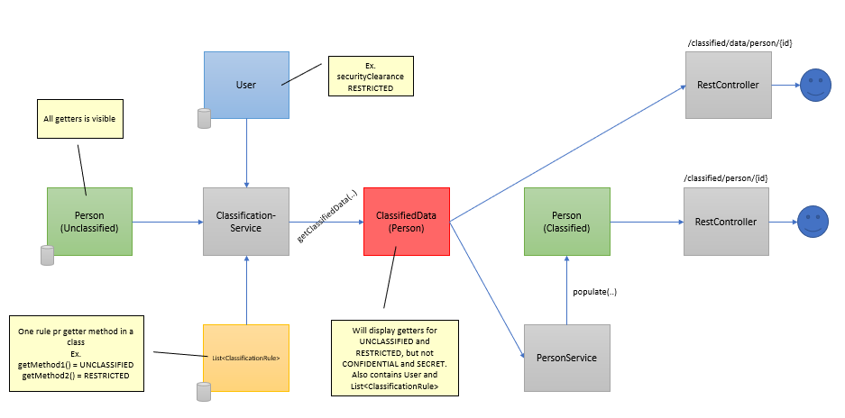

## What does this example application do?

This application is a simple implementation with help from reflection.

The point is to hide specific field information in a data object that the user do not have clearance to see.

**User** is a simple object containing username and security clearance level for a simulated user.

A data class implements **UnclassifiedData**. All fields is visible at this time.
Data can be anything. In this example a **Person** with some fields.

**ClassificationRules** is object containing a map with all the getter method names of the unclassified data class.
This information should be stored somewhere for every data class. In this example it is hard coded. 

**ClassifiedData** is the result of Users clearance level and Classification rules put together leaving us with a map with
information of what fields (getter methods) the user is allowed access to.

## How is this solved?
Reflection is used to find declared methods starting with string "get". With all getters in hand we put the methodnames as key inside a map. By default we set all values to **Classification.NO_ACCESS** . This ensure us that we do not accidently show info to users that do not have the right clearance level.
Valid classifications in this example is A through D and also NO_ACCESS. A is the lowest level and D the highest.

A manager of some kind would typically define classification level for each getter method of a data object. This results in the **ClassificationRules** class. 

**ClassificationService** have the methods that puts it all together. 

