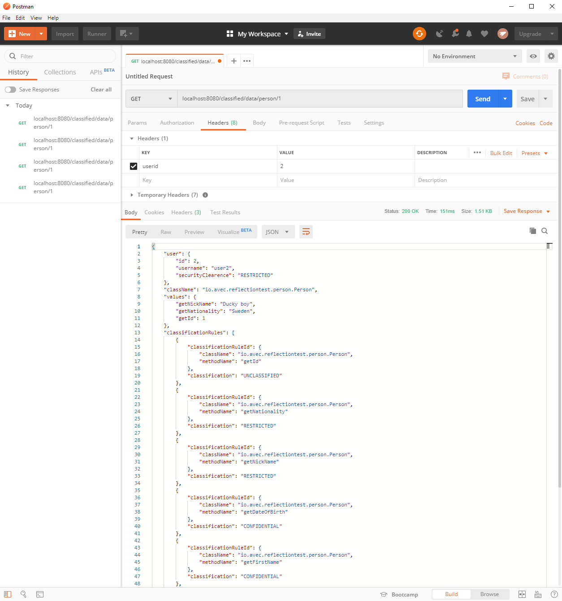

## What does this example application do?

This application is a simple implementation with help from reflection.

The point is to hide specific field information in a data object that the user do not have security clearance to access.

**User** is a simple object containing username and security clearance level for a simulated user.

A data class could be Person, Address, Document, RocketDetails, Contract or whatever. This information is stored i clear text in a database.

**List<ClassificationRule>** is a list of rules. One rule tells us what classification a certain getter method has for this particular data class. 

**ClassifiedData** contains User, className, values and the rules. The values is a map where methodName is the key and value store the classification. Each value contains what the user is allowed to access in a data class. 

## How is this solved?
Reflection is used to find declared methods starting with string "get". With all getters in hand we create a ClassificationRule pr method. By default we set all values to **Classification.NO_ACCESS** . This ensure us that we do not accidently show info to users that do not have the right clearance level. 

Valid classifications in this example is UNCLASSIFIED, RESTRICTED, CONFIDENTIAL, SECRET and also NO_ACCESS. .

A manager or admin would typically define classification level for each getter method of a data object. This results in the **List<ClassificationRule>**. 
  
The application creates dummy data when started. 
* Users with id 1,2,3,4. User 1 has UNCLASSIFIED access, 2=RESTRICTED, 3=CONFIDENTIAL and 4=SECRET
* Person with id 1,2
* ClassificationRules for Person

See ReflectionTestApplication method getPersonRules() to se what access is given for what method. 

See **ClassificationService**, **PersonService** and **PersonController** for more information. 

## How to run
* Start the ReflectionTestApplication from IDE or with help of maven (mvn springboot:run)
* Use Curl, Postman or what you prefer to access an url with support for headers.
* Create Header userid with a prefered id between 1 and 4
* To get a ClassifiedData object representing Person use url http://localhost:8080/classified/data/person/1
* To get a classified version of Person use url http://localhost:8080/classified/person/1

The result should provide something like shown in the image below (using Postman)
